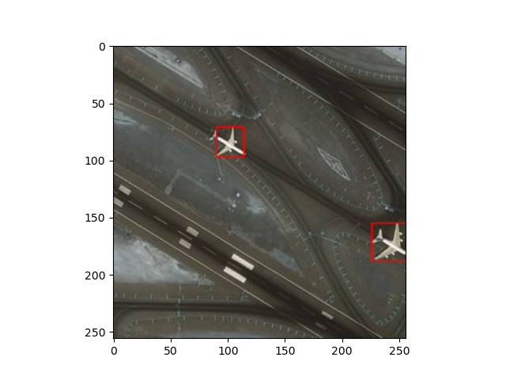

# Object-Detection with RCNNs

---

This repository contains a Tensorflow 2 implementation of a Region-based Convolutional Neural Network (RCNN), trained to detect
aeroplanes from aerial images. The RESISC45 dataset's aeroplane images are used for this task, with the annotations
taken from this [GitHub repo](https://github.com/1297rohit/RCNN/blob/master/Airplanes_Annotations.zip).

VGG16 serves as the backbone, and the final layer (of 1000 classes) is replaced with a 2 neuron Dense layer
for the output. Training approximately converges after 100-120 epochs, with the best model's weights
restored after early stopping. The predictions for some images in the test set are shown below.

